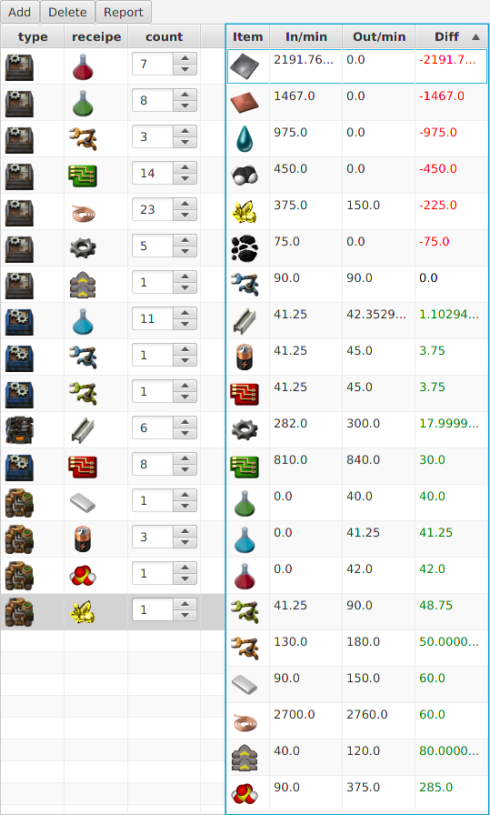

# Factorio Planner

A Planning Tool for Factorio

## Quick Start
To build the project yourself you need a JDK version 8 and Maven installed. Just type "mvn package" in the root directory, and you should end up with a runnable jarfile under target/factorio-*.jar

## Current State
What you see here is pretty much WIP. the current state is functional but rudimentary. A not complete list of important things currently missing, which I may add later

- Nicer GUI (It works so far but is ugly. I suck at GUI programming)
- Load / Save function
- Module slots
- Mod support (Should be easy to implement since this tool uses the factorio game files)
- Currently theres no check if a recipe can be produced by the selected factory type
- No data about power consumption

## Developing / Contributing
Patches are Welcome.
This project uses lombok, which means some source files may appear as broken in IDEs not supporting this. Look on [Lomboks Website]( http://projectlombok.org/) for further information about how to add lombok support to your IDE
